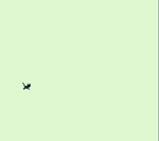

# Overview

This is an important lesson at embedded game design through the hardware of the original Nintendo Gameboy!   

  

There are 2 ROM files in the '/bin' directory, one of the ROMS will show a sprite with movement, another will generate a sound using the Gameboy hardware when a key is pressed on the keyboard

Within the 'bin/' directory, files ending with '.gb' are working gameboy ROM files that could theoretically be connected to a gameboy and be played. Withing the 'developmentapps_gameboy/bgb/' directory is an exe for the emulator in which you may load those files! Right click to load ROM, and aim the file-finder at the ROMS within the local bin directory!  
Press the 'S' key to make the sprite jump, and the arrow keys for movement!  

The purpose of writing this Software was, as a Software Engineer with an emphasis in embedded systems, to familiarize myself with the hardware registers of the Gameboy in order to generate sound, and load custom sprites. All of the Software used to emulate the Gameboy and create the sprites are located in the folder 'developmentapps/'.  

[Software Demo Video](https://youtu.be/kpA8RxzmmRI)

# Development Environment
VIM was used as an IDE  

##### Tools Used  
C Programming language 
Code compiled with GCC and MAKE  
Library used: GBDK-2020 (Gamboy Development Kit 2020 (Link under useful websites)

# Useful Websites

* [GBDK-2020 Github](https://github.com/gbdk-2020/gbdk-2021)
* [GDBK Docs: Getting Started](https://gbdk-2020.github.io/gbdk-2020/docs/api/docs_getting_started.html)

# Future Work

* Add an interactive Background  
* Make a title Screen  
* Add save states  
